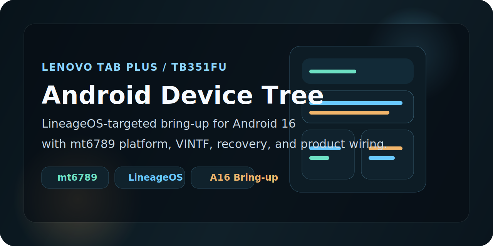

<p align="center">
  
</p>

# Android Device Tree for Lenovo Tab Plus TB351FU

This repository contains the public AOSP / LineageOS device tree currently being used for Lenovo Tab Plus `TB351FU` bring-up work.

The tree is focused on making the device boot and behave correctly on a modern aftermarket Android stack, with current work aimed at Android 16 and LineageOS-based development. It is a bring-up tree, so some parts are still evolving alongside the kernel, vendor, and recovery work.

## Status

- Device codename: `TB351FU`
- Product target: `lineage_TB351FU`
- ROM direction: Android 16 / LineageOS bring-up
- Board platform: `mt6789`
- Bootloader board name: `t808aa`
- Current dependencies: matching kernel tree, vendor tree, and extracted proprietary blobs

> [!NOTE]
> This repository is shared for development and educational use. It combines original Lenovo device information from the stock software base with LineageOS-style bring-up structure and community work needed to make the tree usable in an aftermarket build environment.

## Device Reference

| Item | Value |
| --- | --- |
| Device | Lenovo Tab Plus `TB351FU` |
| Brand / manufacturer | Lenovo |
| Platform | MediaTek `MT6789` |
| Board name | `t808aa` |
| Architecture | `arm64` with `arm` secondary support |
| Kernel source path | `kernel/lenovo/TB351FU` |
| Kernel defconfig | `t808aa_defconfig` |
| Boot image format | Header v4 |
| Partition details | Virtual A/B, vendor boot, metadata partition, super partition |
| Filesystems in-tree | `erofs` for system images, `f2fs` for userdata |
| Security layout | AVB enabled, `vbmeta` flags configured in-tree |
| Device features referenced here | Dolby hooks, Lenovo pen support, tablet-specific hardware configs |

## What This Tree Covers

- product definition and lunch target wiring
- board configuration for the TB351FU platform
- `device.mk` product package and copy rules
- DTBO / prebuilt kernel-side assets used by bring-up
- recovery fstab and rootdir init configuration
- VINTF manifests and compatibility declarations
- extraction scaffolding for proprietary blobs

## Important Files

- [BoardConfig.mk](BoardConfig.mk): platform, partition, kernel, filesystem, and AVB settings
- [device.mk](device.mk): product packages, copy rules, and vendor tree inclusion
- [lineage_TB351FU.mk](lineage_TB351FU.mk): LineageOS product target definition
- [recovery.fstab](recovery.fstab): recovery mount and partition mapping
- [dts/](dts): DTBO-related source used by the current bring-up
- [rootdir/](rootdir): init and fstab content copied into the build
- [vintf/](vintf): manifest and framework compatibility declarations
- [proprietary-files.txt](proprietary-files.txt): blob manifest used with extract-utils

## Build Notes

The tree is set up like a standard LineageOS device tree. Once the matching kernel and vendor trees are present in your source checkout, the usual product target is:

```bash
lunch lineage_TB351FU-userdebug
```

Current in-tree expectations include:

- `TARGET_KERNEL_SOURCE := kernel/lenovo/TB351FU`
- `TARGET_KERNEL_CONFIG := t808aa_defconfig`
- `$(call inherit-product-if-exists, vendor/lenovo/TB351FU/TB351FU-vendor.mk)`

## Blob Extraction Notes

This repository includes the extraction manifest and helper scripts used during bring-up:

- [extract-files.sh](extract-files.sh)
- [setup-makefiles.sh](setup-makefiles.sh)

Those scripts are part of the normal LineageOS extraction flow and are used to generate / refresh vendor-side makefiles from a local stock dump. Proprietary blob redistribution should be handled carefully and with respect to applicable licensing and redistribution limits.

## Current Bring-Up Focus

- stabilizing Android 16 device configuration
- matching kernel and vendor expectations
- improving recovery compatibility
- validating partition, AVB, and boot flow behavior
- cleaning up device-specific packaging and feature declarations

## Credits

- Lenovo, for the stock software base and the original device-side platform content this work builds from
- The LineageOS project, for the extract-utils flow and standard device tree structure used here
- Community developers and testers helping with TB351FU bring-up

## Related Repositories

- Kernel tree: <https://github.com/helllopratik/android_kernel_lenovo_tb351fu>
- Vendor tree: <https://github.com/helllopratik/android_vendor_lenovo_tb351fu>
- Recovery tree: <https://github.com/helllopratik/twrp_device_lenovo_TB351FU>
- TB351FU dev page: <https://helllopratik.github.io/tb351fu/>
